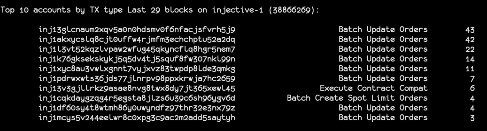

# topsenders

This is a simple utility that shows the account and type of transactions for a range of blocks on a cosmos chain.

Limitations:

* The API used is only available in cosmos-sdk v0.45.2 and later.
* This doesn't use a TUI library and the screen is cleared with ansi resets which might not be pretty.
* It uses periodic polling to get the latest blocks, so it might miss some blocks if the polling interval is too long.
* It's likely that it won't know about some transaction types and will print the block number for those.

## Installation

```
git clone https://github.com/blockpane/topsenders.git
cd topsenders/
go install ./...
```

## Usage

```
Usage of topsenders
  -api string
    	REQUIRED: API URL, ex: http://localhost:1317
  -blocks int
    	optional: max number of blocks to show (default 100)
  -interval duration
    	optional: polling interval, ex: 2s, 250ms (default 2s)
  -rpc string
    	REQUIRED: RPC URL, ex: http://localhost:26657
  -top int
    	optional: how many top senders to show (default 20)
```

## Example

`$ topsenders -api http://injective:1317 -rpc http://injective:26657 -top 10 -interval 250ms`


